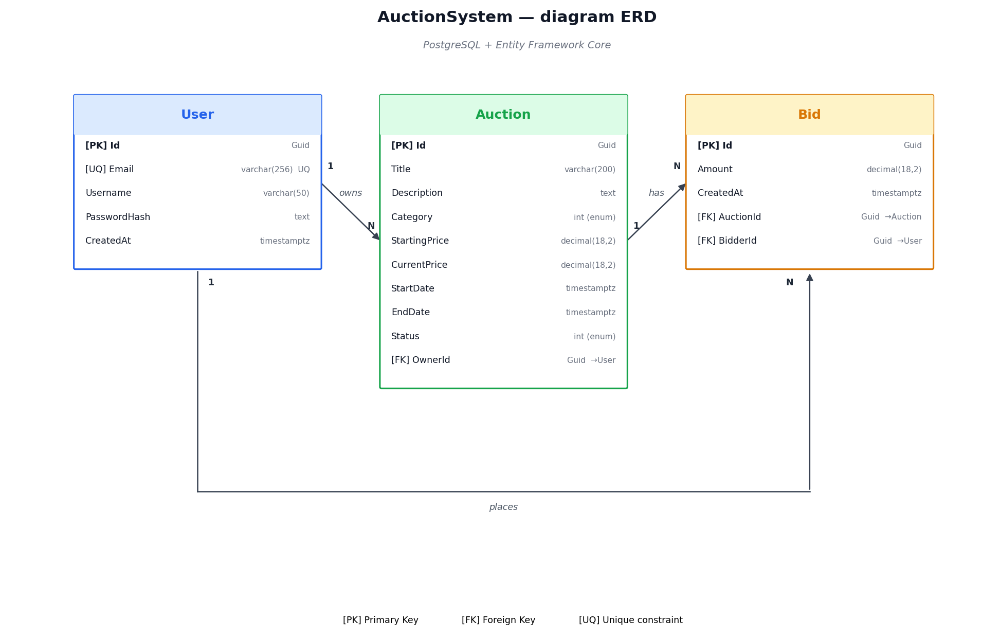

# System Aukcyjny

REST API systemu aukcyjnego z frontendem React. Architektura warstwowa (Controller → Service → Repository), JWT, paginacja, filtrowanie, sortowanie, testy jednostkowe, Docker.

## Wymagania

- .NET 10 SDK
- Node.js 22+
- PostgreSQL 16+ (lub Docker)

## Uruchomienie

### Docker

```bash
cp .env.example .env
docker-compose up --build
```

- API: http://localhost:5000
- Swagger: http://localhost:5000/swagger
- Health: http://localhost:5000/health
- Frontend: http://localhost:5173

### Ręcznie

```bash
cd src/AuctionSystem.Api
dotnet ef database update --project ../AuctionSystem.Infrastructure
dotnet run
```

```bash
cd client
npm install
npm run dev
```

## Architektura

```
REST_lab/
├── AuctionSystem.slnx
├── Dockerfile
├── docker-compose.yml
├── render.yaml
├── fly.toml
├── .env.example
├── .github/
│   └── workflows/
│       └── ci.yml
├── docs/
│   ├── erd.png
│   └── generate_erd.py
├── src/
│   ├── AuctionSystem.Api/
│   │   ├── Controllers/
│   │   │   ├── AuctionsController.cs
│   │   │   └── UsersController.cs
│   │   ├── Middleware/
│   │   │   └── ExceptionHandlingMiddleware.cs
│   │   ├── Program.cs
│   │   ├── appsettings.json
│   │   └── appsettings.Production.json
│   ├── AuctionSystem.Application/
│   │   ├── DTOs/
│   │   ├── Interfaces/
│   │   ├── Services/
│   │   └── Validators/
│   ├── AuctionSystem.Core/
│   │   ├── Entities/
│   │   ├── Enums/
│   │   └── Interfaces/
│   └── AuctionSystem.Infrastructure/
│       ├── Data/
│       ├── Migrations/
│       └── Repositories/
├── tests/
│   └── AuctionSystem.Tests/
└── client/
    ├── Dockerfile
    ├── nginx.conf
    └── src/
        ├── api/
        ├── components/
        ├── hooks/
        ├── pages/
        └── types/
```

Core nie zależy od Infrastructure ani Api. Application korzysta z interfejsów z Core. DI w `Program.cs`.

## Diagram ERD



Regeneracja:

```bash
python3 -m pip install matplotlib
python3 docs/generate_erd.py
```

Relacje:
- `User 1:N Auction` (OwnerId, cascade)
- `Auction 1:N Bid` (AuctionId, cascade)
- `User 1:N Bid` (BidderId, restrict)

## API

### Użytkownicy

| Metoda | Endpoint | Auth |
|--------|----------|------|
| POST | `/api/users` | - |
| POST | `/api/users/login` | - |
| GET | `/api/users` | - |
| GET | `/api/users/{id}` | - |
| PUT | `/api/users/{id}` | JWT |
| DELETE | `/api/users/{id}` | JWT |

### Aukcje

| Metoda | Endpoint | Auth |
|--------|----------|------|
| GET | `/api/auctions` | - |
| GET | `/api/auctions/{id}` | - |
| POST | `/api/auctions` | JWT |
| PUT | `/api/auctions/{id}` | JWT |
| DELETE | `/api/auctions/{id}` | JWT |

### Oferty

| Metoda | Endpoint | Auth |
|--------|----------|------|
| GET | `/api/auctions/{id}/bids` | - |
| POST | `/api/auctions/{id}/bids` | JWT |

### Pozostałe

- `GET /health` — status API + bazy
- `GET /swagger` — OpenAPI

### Parametry `GET /api/auctions`

- `page` (1)
- `pageSize` (10)
- `category` (0–4)
- `status` (0–3)
- `sortBy` — `price`, `price_desc`, `date`, `date_desc`

### Kody HTTP

- `200` — sukces
- `201` — utworzono
- `204` — usunięto
- `400` — błąd walidacji / reguły biznesowej
- `401` — brak / zły token
- `403` — brak uprawnień
- `404` — nie znaleziono

## Słowniki

Kategorie: `0 Elektronika` · `1 Moda` · `2 Dom` · `3 Sport` · `4 Inne`

Statusy: `0 Szkic` · `1 Aktywna` · `2 Zakończona` · `3 Anulowana`

## Technologie

Backend: ASP.NET Core 10, EF Core, PostgreSQL, JWT + BCrypt, FluentValidation, Serilog, Swagger, Health Checks
Frontend: React 19, Vite, Tailwind, Axios, React Router
Testy: xUnit, Moq
DevOps: Docker, Docker Compose, GitHub Actions

## Testy

```bash
dotnet test
```

## Deployment

Konfiguracja gotowa pod hosting kontenerowy (Render, Fly.io, Railway).

- `PORT` z env (`Program.cs`)
- `UseForwardedHeaders` pod reverse proxy
- `/health` z `AddDbContextCheck`
- Migracje przy starcie w `Production`
- CORS z env `Cors__AllowedOrigins`
- Sekrety z env (`Jwt__Key`, `ConnectionStrings__DefaultConnection`)
- `render.yaml`, `fly.toml`
- CI: `.github/workflows/ci.yml`

Render: Blueprint → wybierz repo. Render czyta `render.yaml`.

Fly.io:
```bash
fly launch --no-deploy
fly postgres create --name auctiondb
fly postgres attach auctiondb
fly secrets set Jwt__Key="$(openssl rand -base64 48)"
fly secrets set Cors__AllowedOrigins="https://..."
fly deploy
```

Zmienne środowiskowe: `.env.example`.
